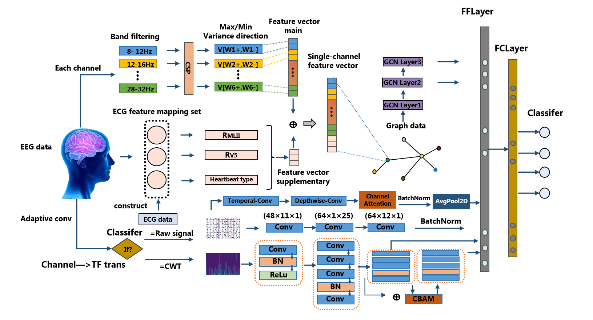
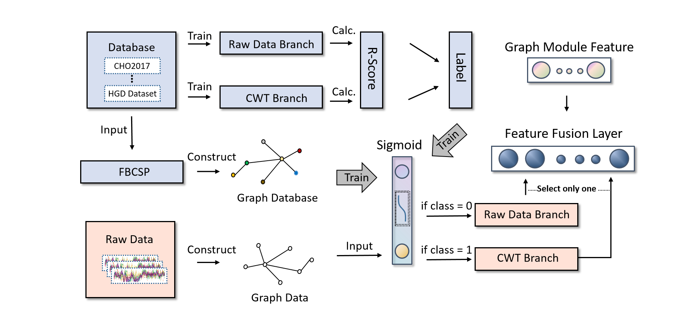

# HAD-GCN 

This is the official implementation of **Adaptive graph convolutional neural network incorporating ECG for
individualized motor imagery EEG classification**. (Preserving two patent-sensitive components as variables/interfaces only).




## Patent-sensitive components not included

1. the adaptive time-frequency branch-selection technique;
2. the adaptive ECG-generation technique.



For a runnable public version:

- branch selection is manually set to `raw` or `cwt`;
- missing ECG supplementary features are zero tensors.

## Implemented public architecture

```text
22-channel EEG trial
├── Graph learning module
│   ├── external ECG feature variable [B, 22, 3]
│   └── three-layer GCN
│
├── Time-frequency module
│   ├── Raw Signal branch (former DSCNN)
│   └── CWT branch (previous CWT branch)
│       └── manual/external branch-selection variable
│
└── Feature fusion
    ├── concatenate graph and selected branch features
    ├── fusion fully connected layer
    └── multiclass classifier
```

**The project also implements the publicly described trial-graph confidence**

calibration: trial nodes are connected using Cz-signal correlation, and a GCN predicts one positive temperature per trial.

## Environment

Designed for:

```text
Python 3.10.20
PyTorch 2.5.1+cu121
CUDA 12.1
```

Install only the additional dependencies:

```bash
python -m pip install -r requirements.txt
```

## Data

For subject 2:

```text
D:\EEG\BCI2a\
├── A02T.gdf
├── A02T.mat      # optional if labels are available in training GDF
├── A02E.gdf
└── A02E.mat
```

## Change subject

Edit one line in `config.py`:

```python
SUBJECT_ID = 2
```

## Select the temporary branch placeholder

```bash
python main.py --branch raw
```

or:

```bash
python main.py --branch cwt
```

